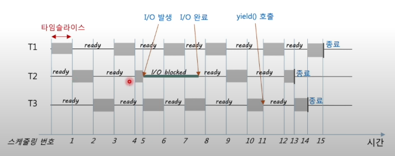

# CPU 스케줄링

## 1. 스케줄링

- CPU의 자원을 어떤 프로세스에게 할당할 것인지 순서를 정하는 것

  - 다중 프로그래밍 시스템
  - CPU 이용률(Utilization) ↑ / 작업 처리율(Throughput) ↑ / 대기시간(Wating time) ↓ 
    / 응답시간(Response time) / 공정성(fairness) / 총처리시간(Turnaround time) ↓ 
  
  

---

---

## 2. 비선점 / 선점 스케줄링

- 비선점 스케줄링
  - 프로세스가 스스로 CPU 반납(비강제)
  - 프로세스가 종료되거나 유휴상태에 돌입한 경우
- 선점 스케줄링
  - 강제적으로 CPU를 할당받음
  - 프로세스에 할당된 타임슬라이스가 만료된 경우
  - 우선순위의 프로세스가 실행되어야 하는 경우

## 3. 비선점 스케줄링

- FCFS
  - Firtst Come, First Served
  - FIFO 큐를 통해서 구현
  - 가장 간단한 알고리즘 다만 처리율이 낮음(평균 대기시간 ↑)

- SJF

  - Shortest Job First
  - 동일한 수행시간을 갖는다면 FCFS로 처리
  - CPU burst를 정확히 예측하기 어려움(지수평균 사용)

  

  - 평균 대기 시간이 작으나 Starvation 발생 가능

- HRN

  - Highest Response-Rate next

## 4. 선점 스케줄링

- Priority 스케줄링

  - 우선순위를 부여하여 우선순위가 높은 순서대로 처리
  - Aging으로 Starvation Starvation 해결
    - Starvationㅡ낮은 우선순위의 프로세스들이 무한히 대기
    - Agingㅡ오랫동안 처리되지 못한 프로세스의 우선순위를 점진적으로 올려줌

- Round Robin(순환 할당)

  - 시간 할당량 지정(Time Slice)
  - Time Slice가 너무 길다면 FCFS와 동일
  - Starvation은 발생하지 않음
  - 순환 FIFO 큐로 구현

- Multilevel-Queue(다단계 큐)

  

  - 프로세스가 대기하는 큐를 여러개로 나누어 구성

  - 프로세스들이 실행특성에 따라 분류될 수 있는 경우 사용

  - 각 큐는 각각의 스케줄링 알고리즘을 가질 수 있음

    

  - 각 큐마다 다른 Time Slice 사용/ 대체로 우선순위가 높으면 Time Slice를 작게 할당하고 우선순위가 낮으면 Time Slice를 크게 할당함

  - 프로세스는 특정 큐에 영구적으로 할당됨

  - 따라서 우선순위가 낮은 큐에서는 Starvation 발생 가능

- Multilevel Feedback Queue(다단계 피드백 큐)

  - 프로세스가 큐를 이동할 수 있도록 허용
  - CPU를 많이 사용하는 프로세스는 점진적으로 우선순위가 낮은 큐로 이동
  - 우선순위가 낮은 큐에서 너무 오래 대기하는 프로세스를 이동시켜줌
