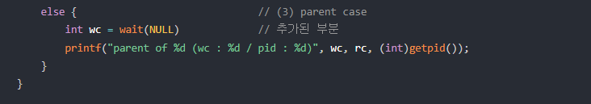
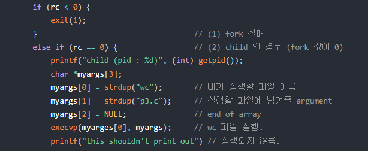

# System call

## 1. System call

- 운영체제의 커널을 호출하는 것

- 프로세스와 관련된 시스템콜
  - fork(), exec(), wait(), exit()

## 2. fork()

- 프로세스를 복제(생성)하는 시스템 콜(부모ㅡ자식)
- fork() 함수가 호출되면 부모프로세스는 0이상의 값(자식 프로세스의 id)을 반환하고 자식프로세스는 0을 반환
- 부모와 자식은 동시에 실행됨

## 3. wait()

- 자식 프로세스가 끝날 때까지 부모 프로세스가 대기하도록 하는 시스템 콜
- 따라서 실행 순서는 자식 프로세스가 우선

## 4. exec()

- 기존의 프로세스를 새로운 프로세스로 전환하는 시스템 콜

- 프로세스 자체는 그대로 두고 내용을 덮어씌워서 변경
- 덮어씌워진 새로운 프로그램이 실행 됨
- 프로세스의 구조를 재활용

